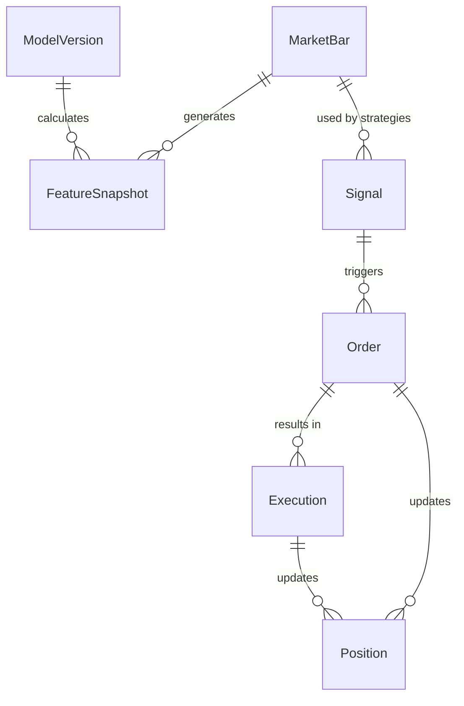

# Data Model

## Database Schema

The Market Intelligence Platform uses PostgreSQL as its primary database. The schema is designed for financial data storage, trading operations, and strategy management.

## Core Entities

### Market Data

#### MarketBar
Stores OHLCV (Open, High, Low, Close, Volume) bar data for various timeframes.

```sql
CREATE TABLE market_bars (
    id SERIAL PRIMARY KEY,
    symbol VARCHAR(20) NOT NULL,
    timestamp TIMESTAMP NOT NULL,
    timeframe VARCHAR(10) NOT NULL,  -- '1m', '5m', '1h', '1d', etc.
    open FLOAT NOT NULL,
    high FLOAT NOT NULL,
    low FLOAT NOT NULL,
    close FLOAT NOT NULL,
    volume FLOAT NOT NULL,
    created_at TIMESTAMP DEFAULT NOW()
);

-- Indexes for performance
CREATE INDEX idx_market_bars_symbol_timestamp ON market_bars(symbol, timestamp);
CREATE INDEX idx_market_bars_timeframe ON market_bars(timeframe);
```

**Fields:**
- `id`: Primary key
- `symbol`: Trading symbol (e.g., 'AAPL', 'SPY', 'BTCUSDT')
- `timestamp`: Bar timestamp (start of the bar period)
- `timeframe`: Bar duration ('1m', '5m', '1h', '1d', '1w', '1M')
- `open/high/low/close`: OHLC prices
- `volume`: Trading volume during the bar period
- `created_at`: Record creation timestamp

#### FeatureSnapshot
Stores calculated technical indicators and features for ML models.

```sql
CREATE TABLE feature_snapshots (
    id SERIAL PRIMARY KEY,
    symbol VARCHAR(20) NOT NULL,
    timestamp TIMESTAMP NOT NULL,
    features TEXT NOT NULL,  -- JSON string of calculated features
    model_version VARCHAR(50) NOT NULL,
    created_at TIMESTAMP DEFAULT NOW()
);
```

**Fields:**
- `features`: JSON string containing calculated indicators (RSI, MACD, Bollinger Bands, etc.)
- `model_version`: Version of the feature calculation model

### Trading Signals

#### Signal
Stores trading signals generated by strategies.

```sql
CREATE TABLE signals (
    id SERIAL PRIMARY KEY,
    symbol VARCHAR(20) NOT NULL,
    strategy_name VARCHAR(50) NOT NULL,
    signal_type VARCHAR(10) NOT NULL,  -- 'BUY', 'SELL', 'HOLD'
    confidence FLOAT NOT NULL,         -- 0.0 to 1.0
    price FLOAT NOT NULL,
    timestamp TIMESTAMP NOT NULL,
    metadata TEXT,                     -- JSON string with strategy-specific data
    created_at TIMESTAMP DEFAULT NOW()
);

CREATE INDEX idx_signals_symbol_timestamp ON signals(symbol, timestamp DESC);
CREATE INDEX idx_signals_strategy ON signals(strategy_name);
```

**Fields:**
- `signal_type`: Action type (BUY, SELL, HOLD)
- `confidence`: Signal strength (0.0 = weak, 1.0 = strong)
- `metadata`: Strategy-specific information (JSON format)

### Trading Operations

#### Order
Tracks trading orders placed through the system.

```sql
CREATE TABLE orders (
    id SERIAL PRIMARY KEY,
    symbol VARCHAR(20) NOT NULL,
    side VARCHAR(5) NOT NULL,          -- 'BUY', 'SELL'
    order_type VARCHAR(10) NOT NULL,   -- 'MARKET', 'LIMIT'
    quantity FLOAT NOT NULL,
    price FLOAT,                       -- NULL for market orders
    status VARCHAR(20) NOT NULL,       -- 'PENDING', 'SUBMITTED', 'FILLED', 'CANCELLED', 'FAILED'
    broker_order_id VARCHAR(100),      -- Broker's order ID
    created_at TIMESTAMP DEFAULT NOW(),
    updated_at TIMESTAMP DEFAULT NOW()
);
```

**Order Status Flow:**
```
PENDING → SUBMITTED → FILLED
        ↓           ↓
      FAILED    CANCELLED
```

#### Execution
Records actual trade executions (fills).

```sql
CREATE TABLE executions (
    id SERIAL PRIMARY KEY,
    order_id INTEGER NOT NULL,
    symbol VARCHAR(20) NOT NULL,
    side VARCHAR(5) NOT NULL,
    quantity FLOAT NOT NULL,
    price FLOAT NOT NULL,
    commission FLOAT DEFAULT 0.0,
    timestamp TIMESTAMP NOT NULL,      -- Execution timestamp
    broker_execution_id VARCHAR(100),
    created_at TIMESTAMP DEFAULT NOW()
);
```

#### Position
Tracks current and historical positions.

```sql
CREATE TABLE positions (
    id SERIAL PRIMARY KEY,
    symbol VARCHAR(20) NOT NULL,
    quantity FLOAT NOT NULL,           -- Positive for long, negative for short
    avg_cost FLOAT NOT NULL,
    market_value FLOAT NOT NULL,
    unrealized_pnl FLOAT DEFAULT 0.0,
    realized_pnl FLOAT DEFAULT 0.0,
    is_active BOOLEAN DEFAULT TRUE,
    created_at TIMESTAMP DEFAULT NOW(),
    updated_at TIMESTAMP DEFAULT NOW()
);
```

### Model Management

#### ModelVersion
Tracks ML model versions and configurations.

```sql
CREATE TABLE model_versions (
    id SERIAL PRIMARY KEY,
    name VARCHAR(100) NOT NULL,
    version VARCHAR(50) NOT NULL,
    model_type VARCHAR(50) NOT NULL,   -- 'classification', 'regression', etc.
    parameters TEXT NOT NULL,          -- JSON string of model parameters
    performance_metrics TEXT,          -- JSON string of performance data
    is_active BOOLEAN DEFAULT FALSE,
    created_at TIMESTAMP DEFAULT NOW()
);
```

## Data Relationships

### Entity Relationship Diagram



### Key Relationships

1. **Market Data → Signals**: Strategies analyze market bars to generate trading signals
2. **Signals → Orders**: Signals can trigger order placement (manual or automated)
3. **Orders → Executions**: Orders result in one or more executions when filled
4. **Executions → Positions**: Executions update position records
5. **Models → Features**: Model versions define how features are calculated

## Data Storage Patterns

### Time-Series Data
Market data is inherently time-series and uses timestamp-based partitioning:

```sql
-- Example query for recent bars
SELECT * FROM market_bars 
WHERE symbol = 'AAPL' 
  AND timestamp >= NOW() - INTERVAL '30 days'
ORDER BY timestamp DESC;
```

### JSON Fields
Flexible metadata storage using JSON fields:

```python
# Example signal metadata
metadata = {
    "indicators": {
        "rsi": 65.3,
        "macd": 0.12,
        "bollinger_position": 0.8
    },
    "strategy_params": {
        "window": 20,
        "threshold": 2.0
    }
}
```

### Audit Trail
All trading-related tables include timestamps for audit purposes:
- `created_at`: Record creation time
- `updated_at`: Last modification time (where applicable)

## Data Retention Policies

### Market Data
- **Intraday data** (1m, 5m, 15m): Retained for 90 days
- **Hourly data**: Retained for 1 year  
- **Daily data**: Retained indefinitely
- **Weekly/Monthly data**: Retained indefinitely

### Trading Data
- **Signals**: Retained for 1 year (configurable)
- **Orders**: Retained indefinitely for regulatory compliance
- **Executions**: Retained indefinitely for regulatory compliance
- **Positions**: Historical positions retained indefinitely

### Model Data
- **Feature snapshots**: Retained for 6 months
- **Model versions**: Retained indefinitely for reproducibility

## Performance Considerations

### Indexing Strategy
```sql
-- Primary performance indexes
CREATE INDEX idx_market_bars_symbol_timestamp ON market_bars(symbol, timestamp DESC);
CREATE INDEX idx_signals_symbol_timestamp ON signals(symbol, timestamp DESC);
CREATE INDEX idx_orders_status ON orders(status);
CREATE INDEX idx_positions_active ON positions(is_active) WHERE is_active = TRUE;
```

### Partitioning (Future Enhancement)
For large-scale deployments, consider time-based partitioning:
```sql
-- Example monthly partitioning for market_bars
CREATE TABLE market_bars_y2024m01 PARTITION OF market_bars
FOR VALUES FROM ('2024-01-01') TO ('2024-02-01');
```

### Query Optimization
- Use prepared statements for frequently executed queries
- Implement connection pooling for concurrent access
- Consider read replicas for analytics workloads

## Data Quality Assurance

### Constraints
```sql
-- Example constraints for data quality
ALTER TABLE market_bars ADD CONSTRAINT chk_positive_volume CHECK (volume >= 0);
ALTER TABLE market_bars ADD CONSTRAINT chk_valid_ohlc CHECK (high >= low AND high >= open AND high >= close AND low <= open AND low <= close);
ALTER TABLE signals ADD CONSTRAINT chk_confidence_range CHECK (confidence >= 0 AND confidence <= 1);
```

### Validation Rules
1. **Price Data**: High ≥ Low, High ≥ Open/Close, Low ≤ Open/Close
2. **Volume**: Non-negative values
3. **Signals**: Confidence between 0 and 1
4. **Timestamps**: Must be valid dates, not future dates for historical data

## Migration Strategy

Database schema changes are managed through Alembic migrations:

```bash
# Create new migration
alembic revision --autogenerate -m "Add new table"

# Apply migrations
alembic upgrade head

# Rollback migration
alembic downgrade -1
```

## Backup and Recovery

### Backup Strategy
1. **Full daily backups** of the entire database
2. **Continuous WAL archiving** for point-in-time recovery
3. **Weekly backup testing** to ensure recoverability

### Recovery Procedures
1. Point-in-time recovery for data corruption
2. Read replica promotion for major failures
3. Cross-region replication for disaster recovery (production)